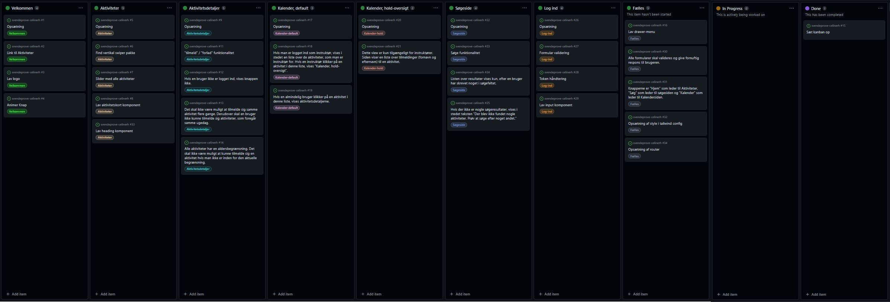
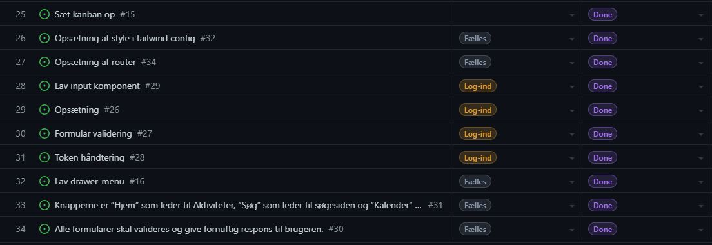
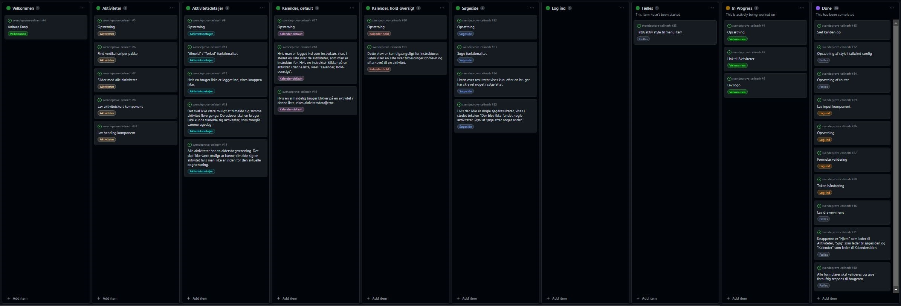
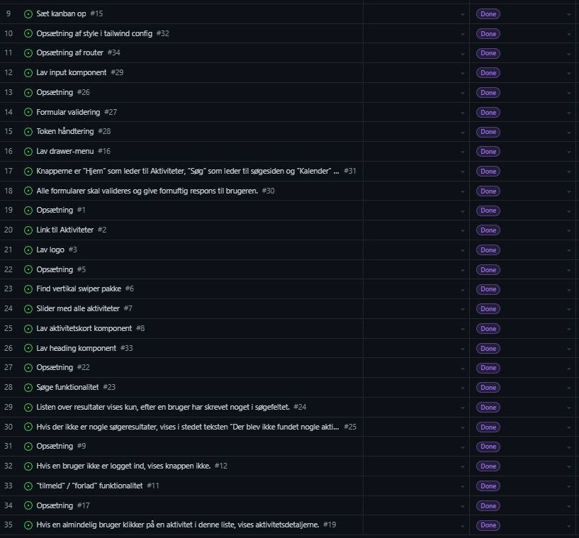
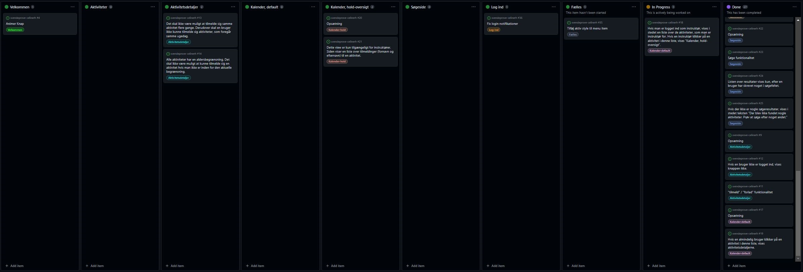
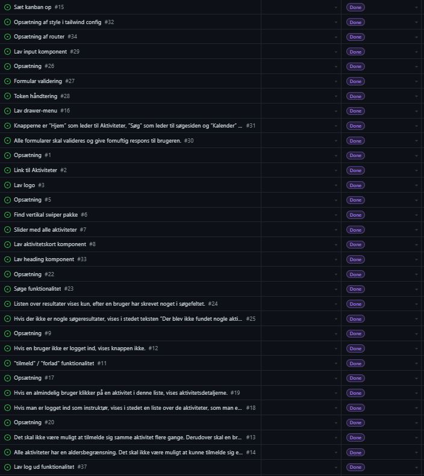
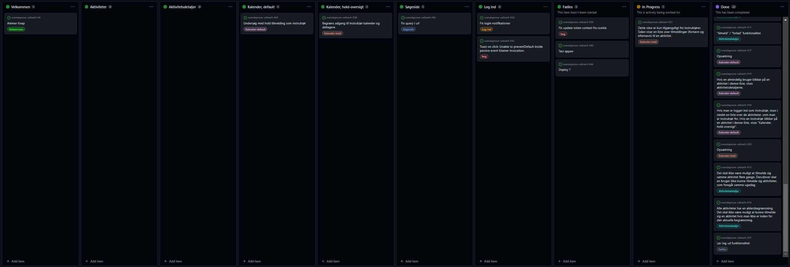
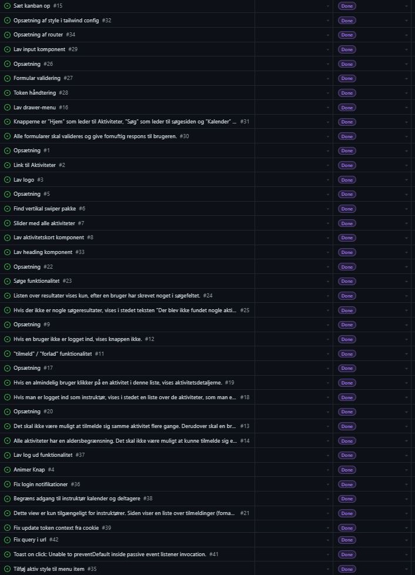
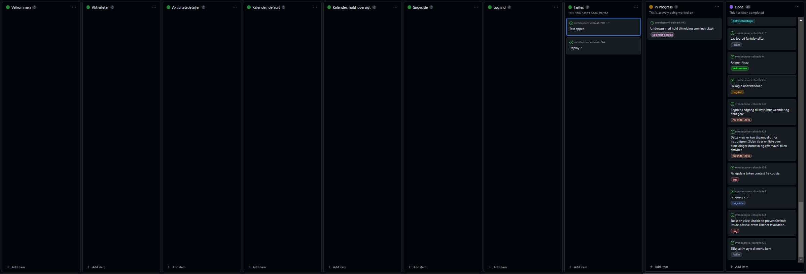
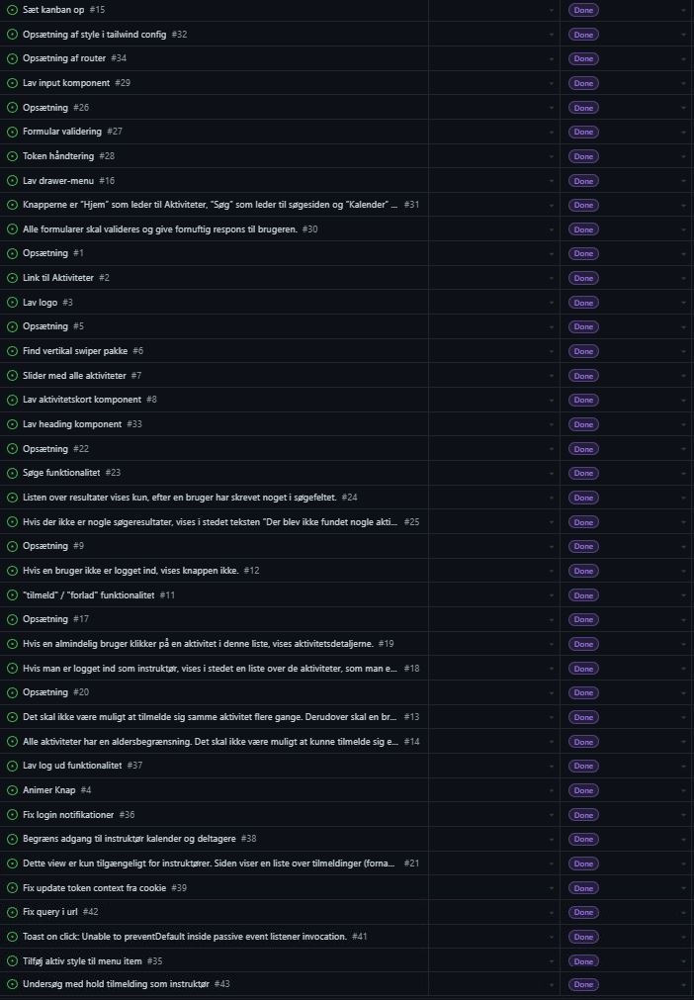

# Dokumentation for Landrup Dans appen

Svendeprøve, Celine Rugaard Holvert  
Forår 2023

---

## Landrup Dans appen

Landrup Dans er en lille danseskole som er i gang med en større ekspansion. Firmaet vil gerne tilbyde deres kunder en digital oplevelse, som skal hjælpe med at få flere tilmeldinger til deres danseaktiviteter. I Landrup Dans web-app'en, er det muligt for brugere at finde og tilmelde sig til forskellige aktiviteter, der afvikles på skolen.

### Kom igang

Dette projekt skal først have installeret sine dependencies med `npm install` og derefter startes appen med `npm start`.

### URL adresser

`/`

`/aktiviteter`

`/aktiviteter/:id`

`/soeg`

`/kalender`

`/kalender/aktiviteter/:id`

`/login`

`/404`

### Predefinerede brugere

| id  | username    | password | age | role       |
| :-: | :---------- | :------: | :-- | :--------- |
|  1  | instructor1 |   1234   | 24  | instructor |
|  2  | instructor2 |   1234   | 32  | instructor |
|  3  | instructor3 |   1234   | 27  | instructor |
|  4  | instructor4 |   1234   | 31  | instructor |
|  5  | user1       |   1234   | 14  | default    |
|  6  | user2       |   1234   | 17  | default    |
|  7  | user3       |   1234   | 21  | default    |
|  8  | user4       |   1234   | 24  | default    |
|  9  | user5       |   1234   | 52  | default    |
| 10  | user6       |   1234   | 51  | default    |

### Udleveret API

APIet kan klones fra GitHub her: https://github.com/rts-cmk/landrup-dans-api

---

## Tech-stack

**React** | _JavaScript bibliotek, der bruges til at bygge brugergrænseflader_  
Jeg har valgt at bruge React, da det er et populært framework med et stort community omkring det, herunder mange React kompatible pakker, som gør at jeg som udvikler ikke skal skrive alt fra bunden selv. Reacts dokumentation er dybdegående og gennemført med brugbare eksempler. Derudover er der stor efterspørgsel på react-udviklere på arbejdsmarkedet.

**TailwindCSS** | _utility-first CSS framework_  
Jeg har valgt at bruge TailwindCSS, da det ligesom react er populært, der er en god dokumentation og så er det "utility first" - altså kommer CSS frameworket ikke med stylede komponenter, men derimod med predefinerede klasser. Dette gør det hurtigt at style elementer og med de predefinerede klasser bliver designet mere konsistent. Herudover sørger TailwindCSS også for browser kompabilitet.

**React Router Dom** | _page routing_  
Jeg har valgt at bruge React Router Dom, da det er et bredt anvendt bibliotek. Jeg kan nemt definere og håndtere ruter samt navigere mellem disse. Biblioteket understøtter blandt andet nestede ruter, dynamiske ruter og URL parameter.

**Toastify** | _notifikations bibliotek_  
Jeg har valgt at bruge Toastify, da det er et populært bibliotek som løbende bliver vedligeholdt. Det er nemt at bruge og kræver minimal opsætning. Det er yderst customizable med mulighed for at vise forskellige typer beskeder, animationer og positionering. Ved brug af biblioteket forbedres brugeroplevelsen, ved at give øjeblikkelig feedback til brugeren, så som at bekræfte succesfulde handlinger eller advare brugere om fejl.

**React icons** | _en samling af de mest populære ikon biblioteker_  
Jeg har valgt at bruge pakken, da den har et bredt udvalg af ikoner.

**Yup** | _object schema builder til validering_  
I projektet bruger jeg Yup skemaet til validering med React Hook Form.

**React Hook Form** | _form bibliotek med validering_  
Jeg har brugt React Hook Form til skemabaseret formularvalidering med Yup. Biblioteket validerer input data op mod det definerede skema.

**React Use Cookie** | _React hook til håndtering af cookies_

### Udvikler værktøjer

**Insomnia** | _et værktøj til at designe, debugge og teste API'er_  
Jeg har i projektet brugt Insomnia til at teste det udleverede API.

**GitHub** | _versions styring værktøj_  
Jeg har valgt at bruge GitHub, da det giver mig mulighed for at opbevare og holde styr på forskellige versioner af min kode samt at jeg nemt kan tilgå koden fra forskellige enheder. GitHub er også en stor fordel, når man arbjeder flere sammen om et projekt, da det giver mulighed for versionskontrol på tværs af hinandens kode, kode feeedback og issue tracking.

### Perspektivering

#### React vs. Angular

Både React og Angular er populære frameworks og valget mellem dem afhænger meget af udviklerne på teamets præferencer. Angular er mere opinionated og har flere predefinerede koncepter for, hvordan man f.eks. skal hente data. Derudover skriver man TypeScript i Angular, hvilket mange vil sige gør det nemmere at vedligheolde store applikationer. React skrives i JSX og gør brug af en virtuel DOM, som muliggøre hurtigere rendering af ændinger i applikationen.
Læringskurven er stejlere for Angular end for React, men da Angular er mere opinionated kan det være nemmere at lære, fordi man ikke skal tage så mange valg selv.

#### TailwindCSS vs. Emotion

TailwindCSS udstiller predefinerede CSS klasser, er hurtigt at style med, og giver grundet de predefinerede klasser en mere konsisten style. Med emotion kan style skrives i vanilla CSS, CSS-in-JS, Sass eller Less. Emotion giver en smule mere kontrol end TailwindCSS, da man skriver CSS og ikke bruger predefinere klasser. Begge biblioteker har den fordel at man ikke nødvendigvis har en separat fil til styling.

---

## Skalerbarhed

Jeg har efter bedste evne haft fokus på følgende i forhold til skalerbarhed:

- Veldokumenteret kode: At skrive kode der er selvdokumenterende herunder variabel navne, der fortæller noget om værdien de holder.
- Codesplitting: At opdele funktioner i separate komponenter og hooks både for overskuelighedens skyld men også for genbrugelighed.
- Lavet TailwindCSS klasser: Lavet Tailwind klasser til de elementer der går igen i designet, f.eks. knapper, navigations link og sider. Skal stylen i fremtiden ændres kan dette derfor gøres én gang i `index.css` og ikke på hvert element, som ellers havde været tilfældet uden brug af custom klasse.
- Brugt et notifikations bibliotek: Så notifikationer ser ens ud på tværs af appen, og at der nemt kan tilføjes flere i forbindelse med fremtidige features.
- Alle farver og skriftstørrelser er sat op, så de nemt og hurtigt kan skiftes på tværs af hele web-appen, hvis appen på et tidspunkt skal have et andet udtryk.

---

## Forbedringer

I fremtiden kunne følgende features være fede at implementere i projektet:

- Understøtte offline, så man kunne tilgå tilmeldte hold og f.eks. se møde tidspunkt selvom man er offline.
- Login med Facebook, Google etc.
- Implementere max deltagere på aktivitet
- Søgefunktion, hvor man kan søge på instruktører og visuelt kunne se hvilken aktivitet instruktøren var knyttet til

---

## Valgfri opgave C - Cookies

Jeg har valgt at lave valgfri opgave C - Cookies. Jeg har på login siden (`/login`) lavet en checkbox "Husk mig", som sørger for at gemme token i en cookie, så brugeren bliver husket. Cookiens varighed bestemmes af tokens varighed, altså gemmes cookien i en time.

---

## Ændringer

Ændringer jeg har valgt at lave i forhold til designet / kravspecifikation for bedre brugeroplevelse:

- Navigation
  - Aktiv style på ikonet for den aktuelle side.
- Aktiviteter (`/aktiviteter`)
  - Muligheden for at logge ud: Da aktiviteter siden ifølge designet har hjem ikon i navigationen, har jeg valgt at tilføje muligheden for at logge ud på denne side, da det er mest intuitivt at kunne logge ud fra “hjem”.
- Aktivitetsdetalje side (`/aktiviteter/:id`)
  - Kravspecifikation nævner at der skal vises ugedag og tidspunkt på aktiviteten, så det er tilføjet (fremgår ikke af designet).
  - For instruktører:
    - Instruktører skal ikke kunne tilmelde deres eget hold
    - Instruktører skal ikke kunne tilmelde sig aktiviteter på samme dag, som de selv er instruktør for en aktivitet
- Søgeside (`/soeg`)
  - Jeg har lavet en placeholder i søgefeltet, der guider brugeren til at vide, hvad vedkommende kan søge på/ efter.
  - Jeg har lavet autofocus på søgefeltet, da søgefeltet er det eneste på siden.
- Kalender (`/kalender`)
  - Da der ingen steder i designet/ opgavebeskrivelsen/ kravspecifikationen er beskrevet, hvorfra man skal tilgå login siden, har jeg valgt at det sker på kalender siden, da indholdet her, kræver at man er logget ind.
  - For instruktører:
    - Jeg har lavet så instruktører kan se de aktiviteter de er instruktører for OG de aktiviteter som de selv deltager i altså som almindelig deltager.
- Kalender, hold-oversigt for instruktører (`/kalender/aktiviteter/:id`)
  - Har ikke afkortet titlen her som designet viser, da titlen også er afkortet i oversigten (`/kalender`) og jeg mener at man bør se hele teksten et af stederne.
- Login (`/login`)
  - Har tilføjet en “husk mig” checkbox (Valfri opgave C)
  - Det er ikke særlig brugervenligt at havne på login siden uden at kunne navigere videre / tilbage (man kan selvfølgelig altid bruge browserens tilbage-knap). Da appen tillader at man kan se aktiviteter og søge uden at være logget ind, så har lavet et link der fører til aktiviteter siden.
- 404 (`/404`)
  - Side der håndtere alle ikke eksisterende routes

---

## Kode-eksempel

Jeg har valgt at fremhæve to kode eksempler

1. En custom hook, jeg bruger når jeg fetcher aktiviteter
2. Hvordan jeg håndterer token

Jeg vil gå i dybden med fetch hooket nedenfor, og token håndteringen vil jeg gennemgå i min fremlæggelse.

### Custom hook

Nedenstående stykke kode er en custom hook, der henter en liste af aktiviteter fra Laudrup Dans API'et ved hjælp af et fetch kald. I hooket bliver der deklareret tre states ved hjælp af useState hooket. Disse er `activities`, `isLoading` og `error` og kan opdateres med deres setter funktion, henholdsvis `setActivities`, `setIsLoading` og `setError`.

- **activities** initiale state er `null`, da data endnu ikke er hentet.
- **isLoading** initiale state er `true`, da hentningen af data påbegyndes.
- **error** initiale state er `null`, da der ingen fejl er før hentningen af data.

Fetch kaldet er wrappet i useEffect hooket, der kun udfører fetch kaldet 1 gang ved første render, da dependency arrayet er tomt.  
Hentningen af data (JSON fil) udføres med et fetch request med `GET` metoden, hvilket returnerer et promise med et response objekt. Der tjekkes at responset er succesfuldt, ved at tjekke om `response.ok` er `true` (status code er fra 200-299). Hvis ikke responset er succesfuldt, kastes en fejl som gribes af `catch()` og `error` statet opdateres med fejlmeddelelsen samt `isLoading` opdateres til `false`, da der er sket en fejl og data ikke længere hentes. Hvis responset derimod er succesfuldt, så ekstraheres JSON body'en fra response objektet ved hjælp af `json()` metoden. `json()` metoden returnere endnu et promise, der resulterer i et JavaScript objekt, som i dette tilfælde er et array af aktiviteter. `activities` opdateres med array'et og `isLoading` opdateres til `false`, da data nu er blevet hentes. Til sidst i hooket returneres et objekt med de tre states, så de kan bruges i andre komponenter.

```
//useActivities.js

import { useEffect, useState } from "react";

const useActivities = () => {
  const [activities, setActivities] = useState(null);
  const [isLoading, setIsLoading] = useState(true);
  const [error, setError] = useState(null);

  useEffect(() => {
    fetch(`http://localhost:4000/api/v1/activities`, {
      method: "GET",
    })
      .then((response) => {
        if (!response.ok) {
          throw Error("Could not fetch the data for that resource");
        }
        return response.json();
      })
      .then((data) => {
        setActivities(data);
        setIsLoading(false);
      })
      .catch((error) => {
        setIsLoading(false);
        setError(error.message);
      });
  }, []);

  return { activities, isLoading, error };
};

export default useActivities;

```

`useActivities` hooket importeres der, hvor det skal bruges og anvendes på følgende måde:

```
const { activities, isLoading, error } = useActivities();
```

Objektet destruktureres og herefter kan de tre variabler anvendes i komponentet til at håndtere når der ventes på data, hvis der opstår fejl ved hentning af data eller hvis data hentes succesfuldt.

Her er et eksempel af brugen af variablerne fra aktiviteter siden (`/aktiviteter`). Hvis der er en fejl, vises `ErrorMessage` komponentet, hvis data stadig loades vises `Spinner` komponentet og hvis data hentes succesfuldt så vises aktiviteterne.

```
//Activities.js

<div className="page h-screen flex flex-col gap-6">
      <Heading title="Aktiviteter" />
      {error && <ErrorMessage />}
      {isLoading && <Spinner centered />}
      {activities && (
        <Swiper>
          {activities?.map((activity) => (
            <ActivityCard
              key={activity.id}
              id={activity.id}
              imageSource={activity?.asset?.url}
              title={activity?.name}
              minAge={activity?.minAge}
              maxAge={activity?.maxAge}
            />
          ))}
        </Swiper>
      )}
      {token && <LogOut />}
      <Navigation />
    </div>
```

### Tokenhåndtering

Følgende kode vil jeg komme ind på i min fremlæggelse.

```
//TokenProvider.js

import { useContext, useState, createContext, useEffect } from "react";
import { getCookie } from "react-use-cookie";

const TokenContext = createContext(null);

export const useToken = () => {
  return useContext(TokenContext);
};

function TokenProvider({ children }) {
  const [token, setToken] = useState(JSON.parse(getCookie("token", null)));

  return (
    <TokenContext.Provider value={{ token, setToken }}>
      {children}
    </TokenContext.Provider>
  );
}

export default TokenProvider;

```

`TokenProvider` importeres der, hvor den skal bruges og anvendes på følgende måde:

```
<TokenProvider>
  <RouterProvider router={router} />
</TokenProvider>
```

---

## Projektlog

Jeg satte tirsdag formiddag et kanban board op i GitHub projects, som jeg har brugt til at holde styr på mine tasks igennem hele projektet. Det kan ses her: https://github.com/orgs/rts-cmk-wu07/projects/22

Nedenfor har jeg sat screenshots ind af boardet og en liste af de færdiggjorte tasks (akkumuleret) fra dag til dag.

### 14/03/2023 Tirsdag formiddag:



### 14/03/2023 Tirsdag eftermiddag - DONE:



### 15/03/2023 Onsdag morgen:



### 15/03/2023 Onsdag eftermiddag - DONE:



### 16/03/2023 Torsdag morgen:



### 16/03/2023 Torsdag eftermiddag - DONE:



### 17/03/2023 Fredag morgen:



### 17/03/2023 Fredag eftermiddag - DONE:



### 20/03/2023 Mandag morgen:



### 20/03/2023 Mandag eftermiddag - DONE:



---
